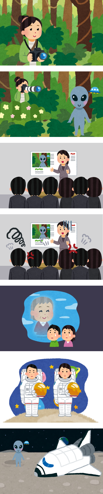

# [2024-2]게임프로그래밍 2조 프로젝트
### 개발환경 및 팀 구성

개발 플랫폼 : Unity 2D로 개발

김현지 | 송지은 | 이정규 | 최준호

## 스토리
주인공의 할머니는 외계인의 사진을 찍으러 다니는 사진작가였음. 할머니는 운좋게 진짜 외계인의 사진을 찍어 발표했으나 사람들은 할머니를 사기꾼이라고 욕함. 결국 할머니는 세상에 인정받지 못하고 세상을 떠남. 이후 주인공은 우주비행사가 됐음. 우주로 나가 외계인의 사진을 찍고 무사히 지구로 돌아와 할머니의 한을 풀자!

중간중간 장애물이 있을것이고.. 외계인과 장애물을 피해 무사히 우주선으로 도망치는 것이 목표

## 프로젝트 요약

상하좌우 키 조작으로 주인공을 움직여 맵을 탈출하는 게임

### 프로젝트 내용

레벨 1~5까지 있고, 레벨 1 시작 전에 외계인의 사진을 찍고 도망가는 것으로 시작함.

외계인들이 막 쫒아오고, 주인공은 시작점에서 도착점까지 방향키
를 잘 눌러 장애물을 피하며 이동함.

중간에 차별점을 둔다면.. 스페이스 바를 눌러 사진을 찍어 외계인들에게 몇초간 스턴을 건다. - 한레벨에서 한두번만 사용할수있도록 제한을 둔다.

이후 모든 레벨을 다 깨면 우주선을 타고 지구에서 외계인 사진을 발표하는 것으로 마무리

## 개발 체크리스트
### 요구사항 목록
#### 메인

- 필요한 소스
    - [ ]  스타트 버튼
    - [ ]  게임 방법 버튼
    - [ ]  게임 방법 설명 페이지
    - [ ]  타이틀 이미지
    - [ ]  타이틀 배경 이미지
- 구현할 내용
    - [ ]  스타트 버튼을 누르면 인게임으로 이동
    - [ ]  게임 방법 버튼을 누르면 게임 방법 설명 페이지를 띄움
    - [ ]  타이틀 이미지와 타이블 배경 이미지, 각 버튼을 적절하게 배치
    - [ ]  게임 방법 이미지를 닫을 버튼

#### 인게임 - UI

- 필요한 소스
    - [ ]  현재 어느 stage인지 보여주는 화면
    - [ ]  현재 남은 생명을 보여주는 하트
    - [ ]  현재 어느 스테이지인지 보여주는 UI
    - [ ]  잠시 멈춤 버튼?
    - [ ]  현재 남은 시간을 보여주는 게이지
    - [ ]  (스킬을 넣는다고 하면) 스킬 게이지
    - [ ]  현재 스킬을 사용할 수 있다는 사실을 알려주는 UI
- 구현할 내용
    - [ ]  게임 시작 버튼을 누르면 현재 어느 stage인지 보여주고 인게임으로 넘어가도록 함
    - [ ]  하트는.. 스테이지마다 초기화 할건지?
    - [ ]  몬스터에게 공격당하면 하트가 하나씩 사라진다
    - [ ]  현재 어느 스테이지인지 UI로 사용자에게 알려준다.
    - [ ]  잠시 멈춤 버튼을 누르면 화면이 살짝 어두워지면서 모든 몬스터와 캐릭터가 멈춘다.
    - [ ]  시간 초기화
    - [ ]  시간이 줄어듦
    - [ ]  시간이 모두 지나가면 게임오버됨
    - [ ]  스킬게이지 초기화
    - [ ]  스킬게이지가 천천히 오름
    - [ ]  스킬게이지가 모두 차면 스킬을 사용할수있음
    - [ ]  스킬게이지가 모두 차면 스킬을 사용할 수 있다는 사실을 알려주는 UI로 전환
    - [ ]  스킬을 사용
    - [ ]  스킬을 사용한 후 다시 원래의 UI로 전환, 스킬게이지 초기화

#### 인게임 -  플레이

- 필요한 소스
    - [ ]  캐릭터 소스
        - [ ]  걷기 애니메이션
        - [ ]  움직이지 않을때 애니메이션
        - [ ]  스킬 사용 애니메이션
    - [ ]  몬스터 소스
        - [ ]  걷기 애니메이션
        - [ ]  움직이지 않을 때 애니메이션
    - [ ]  배경 소스 → 배경 디자인 확정/ 장애물 처리/ 얼마나 보여줄것인지
    - [ ]  도착 지점 소스
- 구현할 내용
    - [ ]  상하좌우 키를 누르면 그에 따라 캐릭터가 움직임
    - [ ]  움직일땐 걷기 애니메이션, 움직이지 않을때는 제자리에서의 애니메이션
    - [ ]  스킬 사용시 스킬이 사용되는 애니메이션
    - [ ]  스킬 사용시 모든 몬스터가 3초간 멈춤
    - [ ]  장애물을 뚫고 넘어가지 못하도록
    - [ ]  몬스터에 닿으면 생명이 하나 닳도록함
    - [ ]  도착 지점에 닿으면 다음 스테이지에 넘어감

### 게임오버

- [ ]  최종으로 도달한 스테이지 표시
- [ ]  메인화면으로 이동 버튼
- [ ]  다시 플레이 버튼
